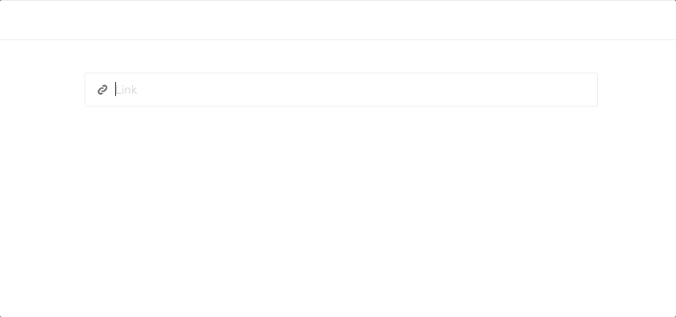

# ClientSide JSON Link Tool for Editor.js

### An Enhanced Fork of the Link Tool for the [Editor.js](https://codex.so/editor) made by [Codex Team](https://codex.so)

[](https://badge.fury.io/js/%40ahmedrowaihi%2Fjson-link)
[]

##

Link Block for the [Editor.js](https://codex.so/editor).



## Features

Allows adding link previews to your articles.

## Installation

### Install via NPM

Get the package

```shell
npm i --save-dev @ahmedrowaihi/json-link
```

Include module at your application

```javascript
const JSONLinkTool = require("@ahmedrowaihi/json-link");
```

### Download to your project's source dir

1. Download folder `dist` from repository
2. Add `dist/bundle.js` file to your page.

### Load from CDN

You can load the specific version of a package from [jsDelivr CDN](https://www.jsdelivr.com/package/npm/@ahmedrowaihi/json-link).

`https://cdn.jsdelivr.net/npm/@ahmedrowaihi/json-link@2.5.0`

Then require this script on page with Editor.js through the `<script src=""></script>` tag.

## Usage

Add a new Tool to the `tools` property of the Editor.js initial config.

```javascript
const editor = EditorJS({
  ...

  tools: {
    ...
    linkTool: JSONLinkTool,
  },

  ...
});
```

# About Ahmed Rowaihi


Ahmed Rowaihi is a software engineer and a full-stack developer. He doing bachelor's degree in computer science at the Arab Open University (AOU) in KSA. He is passionate about web technologies and interested in problem-solving, data structures, and algorithms. He is also a fan of open-source software.

| 🌐                                           | Twitter                                           | LinkedIn                                                    | GitHub                                   |
| -------------------------------------------- | ------------------------------------------------- | ----------------------------------------------------------- | ---------------------------------------- |
| [ahmedrowaihi.lol](https://ahmedrowaihi.lol) | [@ahmedrowaihi](https://twitter.com/ahmedrowaihi) | [Ahmed Rowaihi](https://www.linkedin.com/in/ahmed-rowaihi/) | [@ahmedrowaihi](github.com/ahmedrowaihi) |
